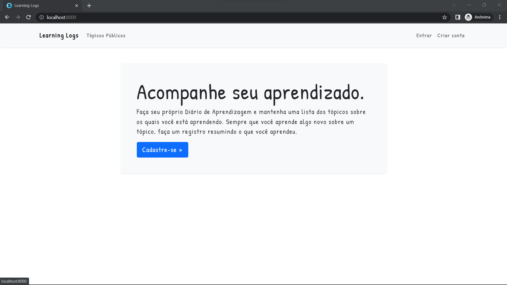
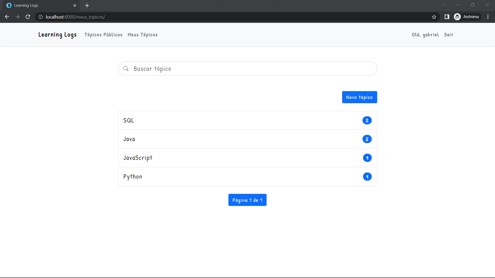
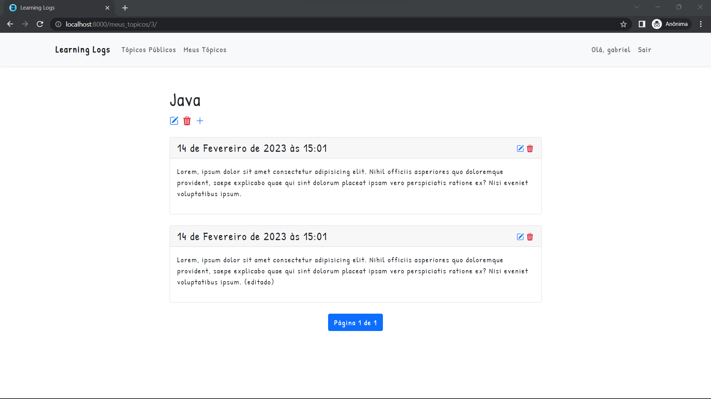

# Learning Logs

Django app to help track learning.

## Screenshots







## Tools

[](https://www.djangoproject.com/)
[](https://getbootstrap.com/)

## Run locally

The first thing to do is to clone the repository:

```sh
git clone https://github.com/souogabrieel/learning_logs.git
cd learning_logs
```

Create a virtual environment to install dependencies in and activate it:

```sh
python -m venv venv
source venv/Scripts/activate
```

Then install the dependencies:

```sh
pip install -r requirements.txt
```

Once `pip` has finished downloading the dependencies:

```sh
python manage.py makemigrations
python manage.py runserver
```

And navigate to `http://localhost:8000`.
